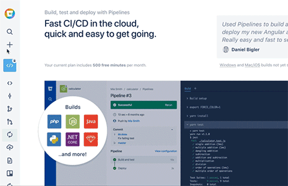
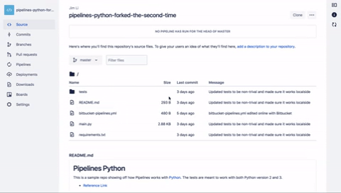
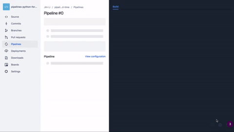

# Pipelines Java

Pipelines allows you to put your Bitbucket hosted code to work. It enables you to build, test, and deploy your code using the cloud and the principals of [CI/CD](https://www.atlassian.com/continuous-delivery/ci-vs-ci-vs-cd). You might like to run tests triggered by any git push to Bitbucket, to confirm that your commit did not introduce any new problems. Or, you could deploy a new version of your code, automatically, whenever your tests complete successfully; turning on features at your leisure using feature flags. Let's get started! 

This is an example repo showing [Bitbucket Pipelines](https://confluence.atlassian.com/bitbucket/build-test-and-deploy-with-pipelines-792496469.html) in a Java environment. 

Pipeline example repos:

  * [Python](https://bitbucket.org/bitbucketpipelines/pipelines-python/src/master/)

  * [Laravel](https://bitbucket.org/bitbucketpipelines/pipelines-guide-laravel/src/master)

  * [Node](https://bitbucket.org/bitbucketpipelines/pipelines-node/src/master/)

  * [PHP](https://bitbucket.org/bitbucketpipelines/pipelines-php/src/master/)

  * [Ruby](https://bitbucket.org/bitbucketpipelines/pipelines-ruby/src/master/)

[Pipelines's Java reference page](https://confluence.atlassian.com/bitbucket/java-with-bitbucket-pipelines-872013773.html)


## Setup
For this demo, all you need to do is import this repo and enable pipelines to get your first pipeline to run!

**Note:** Make sure you have Maven installed.

1. Import this repository by: 

     * clicking the plus sign

     * under import select **Repository**

     * paste this url: [https://bitbucket.org/bitbucketpipelines/pipelines-guide-java/src/master/](https://bitbucket.org/bitbucketpipelines/pipelines-guide-java/src/master/)

     * give your imported repo a name

    

2. On the left navigation bar, click **Pipelines** and scroll down to view the bitbucket-pipelines.yml file. Click **Enable**

    

3. Watch your build run!

    

**Note:** Bitbucket Pipelines includes fifty free minutes per account, at the time of writing. You can check your team or account's minutes usage for the month by clicking your **Avatar** > **Bitbucket settings** > **Plan details**.


## Basic Commands

File: `bitbucket-pipelines.yml`


```
image: maven:3.3.9

pipelines:
  default:
    - step:
        caches:
          - maven
        script: # Modify the commands below to build your repository.
          - mvn -B verify # -B batch mode makes Maven less verbose
```

For in-depth configuration information, visit the Bitbucket Pipelines [YAML Configuration Page](https://confluence.atlassian.com/bitbucket/configure-bitbucket-pipelines-yml-792298910.html). A list of the more common keywords are listed below.

`step`: Each step loads a new Docker container that includes a clone of the current repository.

`script`: A list of commands that are run, in order.

`caches`: Store downloaded dependencies on our server, to avoid re-downloading for each step.

`artifacts`: Defines files that are produced by a step, such as reports and JAR files, that you want to share with a following step.


## Advanced Commands

Connecting to a database can be as simple as adding a few lines to `bitbucket-pipelines.yml` to specify and define the database.

The resulting file may look something like this:


```
image: maven:3.3.9

pipelines:
  default:
    - step:
        caches:
          - maven
        script: # Modify the commands below to build your repository.
          - mvn -B verify # -B batch mode makes Maven less verbose
          
        services: 
          - mongo 

definitions: 
  services: 
    mongo: 
      image: mongo
```


For different database examples, visit the Bitbucket Pipelines [Database Page](https://confluence.atlassian.com/bitbucket/test-with-databases-in-bitbucket-pipelines-856697462.html).
